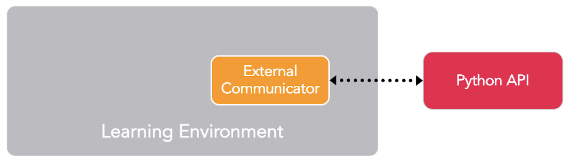

# FloatPropertiesChannel of MLagents (0.14.1)

### To pass agent observations from Unity to Python



**Components of the Unity MLagents Plugin**

Unity environment, External Communicator and Python API are the three main components of the Unity MLagents plugin. The Python API of the plugin facilitates interaction, such as launching training, testing etc., with the unity environment. Communication between the Python API and the environment is handled by the External Communicator. Of many things, we can access the observations of an agent through Python API functionalities.

**Side Channels**

Side channels provide an alternative approach to exchange data (agent observations) between Unity and Python API outside the machine learning loop (these observations are not used in training the agent) .

One such side is the FloatPropertiesChannel. The float properties of the instance are accessed via FloatPropertiesChannel, part of the plugin Python API. This side channel consists of a collection of float properties which can be used to transfer data that is designated as a float property in the Unity environment.

The FloatPropertiesChannel, among others, supports two methods : setproperty() and getproperty(). The setproperty method is used to set the value of the property. The getproperty method is used to access the value of the property with Python.

For example

**In Unity – C # script attached to the agent**

```csharp
var variable_name = Academy.Instance.FloatProperties;
variable_name.SetProperty("property_name", (float)property_to_be_passed); 
```

**In IPython**

```python
import mlagents_envs
from mlagents_envs.environment import UnityEnvironment
from mlagents_envs.side_channel.float_properties_channel import FloatPropertiesChannel

# creating a float properties channel
channel_name = FloatPropertiesChannel()

# assigning the Unity environment executable to a variable
env_name = UnityEnvironment(base_port = port_number, file_name = "env_executable_name, "
side_channels = [channel_name])

# attribute value assigned to var_name variable
done = False
while not done :
  env.step()
  var_name = channel_name.get_property("property_name")
```
