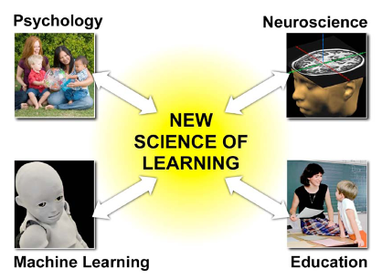

Meltzoff, Andrew N. et al. “[Foundations for a new science of learning.](https://www.semanticscholar.org/paper/Foundations-for-a-new-science-of-learning.-Meltzoff-Kuhl/bab710afa6f2b36d161571fe48467efd80e3d0ad)” Science 325 5938 (2009): 284-8 .

This is a paper exploring converging insights from research in various disciplines directed towards the same goal – to uncover the underlying mechanism of learning in humans. One common factor is that most researchers utilize data obtained from observing children as they seem to agree that the most active phase of learning happens during childhood. The authors feel that studies, especially, of child development, plasticity of human brains and computational methods lead to insights that can revolutionize educational approaches.

One of the insights from computational approaches is that learning is based on computation of statistical patterns.

Ex: Before they are three, children use frequency distributions to learn which phonetic units distinguish words in their native language1,2,use the transitional probabilities between syllables to segment words3, and use covariation to infer cause-effect relationships in the physical world4.

However, these computations are done systematically based on social cues. Social cues are indicators of when and what to learn. These cue are often generated through social interaction.

An evolving physical structure called the brain supports learning by expanding the size of neurons and forming several connections between them. Another interesting fact is that studies have found a noticeable overlap in the structures employed for perceiving and performing an action.

Ex: Newborns as young as 42 minutes old match gestures shown to them, including tongue protrusion and mouth opening5. This is remarkable because infants cannot see their own faces, and newborns have never seen their reflection in a mirror. Yet, newborns can map from observed behavior to their own matching acts, suggesting shared representations for the acts of self and others

Children learn important skills such as imitation, shared attention and empathetic understanding through social interactions. These skills are thought to be powerful social learning mechanisms.

If there Is an aspect of human intelligence that highlights the interplay of computational, social learning and the shared neural structure for perception and production, it is language acquisition.
Here are a few examples the authors have used to showcase this interplay.

Ex: infant perception is strongly influenced by the distributional frequency of sounds contained in ambient language1,2. Infants’ computational skills are sufficiently robust that laboratory exposure to artificial syllables in which the distributional frequencies are experimentally manipulated changes infants’ abilities to discriminate the sounds.

Ex: In foreign-language learning experiments, social interaction strongly influences infants’ statistical learning. Infants exposed to a foreign language at 9 months learn rapidly, but only when experiencing the new language during social interchanges with other humans. American infants exposed in the laboratory to Mandarin Chinese rapidly learned phonemes and words from the foreign language, but only if exposed to the new language by a live human being during naturalistic play. Infants exposed to the same auditory input at the same age and for the same duration via television or audiotape showed no learning

Ex: A candidate mechanism governing the sensitive period for language in humans is “neural commitment”6. Neural commitment is the formation of neural architecture and circuitry dedicated to the detection of phonetic and prosodic characteristics of the particular ambient language(s) to which the infant is exposed. The neural circuitry maximizes detection of a particular language, and when fully developed, interferes with the acquisition of a new language.
The authors emphasize on exploring why the “social” element is so essential in learning and how we can harness it to improve learning.

Kuhl PK, Williams KA, Lacerda F, Stevens KN, Lindblom B. Science 1992;255:606 . [PubMed: 1736364] cited by Meltzoff, Andrew N., Patricia K. Kuhl, Javier R. Movellan and Terrence J. Sejnowski. “Foundations for a new science of learning.” Science 325 5938 (2009): 284-8 .
Maye J, Werker JF, Gerken L. Cognition 2002;82:B101. [PubMed: 11747867] cited by Meltzoff, Andrew N., Patricia K. Kuhl, Javier R. Movellan and Terrence J. Sejnowski. “Foundations for a new science of learning.” Science 325 5938 (2009): 284-8 .
Saffran JR, Aslin RN, Newport EL. Science 1996;274:1926. [PubMed: 8943209] cited by Meltzoff, Andrew N., Patricia K. Kuhl, Javier R. Movellan and Terrence J. Sejnowski. “Foundations for a new science of learning.” Science 325 5938
Gopnik A, et al. Psychol. Rev 2004;111:3. [PubMed: 14756583] cited by Meltzoff, Andrew N., Patricia K. Kuhl, Javier R. Movellan and Terrence J. Sejnowski. “Foundations for a new science of learning.” Science 325 5938
Meltzoff AN, Moore MK. Early Dev. Parenting 1997;6:179 cited by Meltzoff, Andrew N., Patricia K. Kuhl, Javier R. Movellan and Terrence J. Sejnowski. “Foundations for a new science of learning.” Science 325 5938
Kuhl PK. Nature Rev. Neurosci 2004;5:831. [PubMed: 15496861] cited by Meltzoff, Andrew N., Patricia K. Kuhl, Javier R. Movellan and Terrence J. Sejnowski. “Foundations for a new science of learning.” Science 325 5938

<!-- foundations-of-new-learning-science-summary -->
