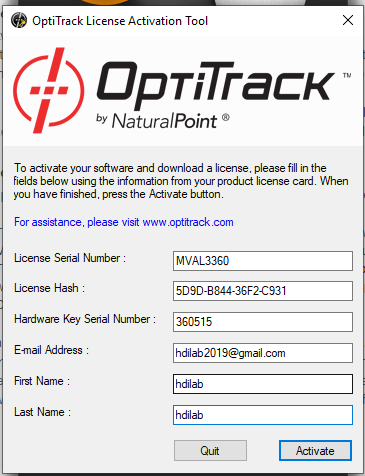
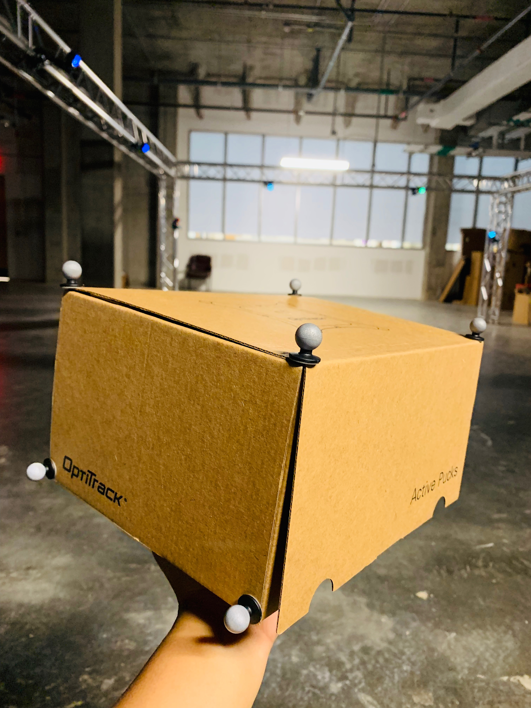

# MOTIVE AND FACEWARE MOCAP DOCUMENTATION

1. **Introduction**

   1. **Download**  
      [Motive 2.1.1 software](https://optitrack.com/downloads/).  
      Follow on screen instructions to run  
      Link to the [quick start guide](https://v21.wiki.optitrack.com/index.php?title=Quick_Start_Guide:_Getting_Started)

   2. **License and Hardware Key**  
      [Licensing FAQs](https://optitrack.com/support/faq/licensing.html#hardware_key)  
      Insert Optitrack Hardware Key(USB) to activate the license  
      Click on License Tools  
      Fill in the required information for license activation

      **Optitrack Credentials** in the attached screenshot

      

      

      The saved license file can be found at C:\ProgramData\OptiTrack\\License

    3. **Open Motive with access**  
        After launching Motive, you will see this screen.

        

    4. **A quick view of the Motive UI**  

        

    5. **Live/Edit mode**  
        Live Mode: This mode is used for recording new takes and for streaming. In this mode 2D cameras actively reconstruct captured 2D images to 3D images

        Edit Mode: This mode is used to replay the recorded takes and make necessary edits.

    6. **Camera Aim and Focus**  
        Aim each camera such that the desired target area is covered. For more information on camera placement check out this [article](https://v21.wiki.optitrack.com/index.php?title=Camera_Placement).

        Select a camera by clicking on it in the ‘camera preview pane’. Right-click and select ‘video mode’ and set it to ‘grayscale’. Zoom in the image to check the focus. To identify focus check out this [article](https://v21.wiki.optitrack.com/index.php?title=Aiming_and_Focusing#Adjusting_Focus).

    7. **Active/Passive  Modes**  
        You can switch between the active and passive tracking mode in the 3D viewport by clicking on the respective tab.

        Active Mode: This mode is used to detect and track the active markers such as the active pucks

        Passive Mode: This mode is used to detect and track the passive markers such as the retro reflective markers.

        Active+Passive Mode: This mode is when trying to detect and track both active and passive markers.

    8. **Markers**  
        <i>Active markers</i> such as the active pucks are usually used to track actor movements. Active markers have unique illumination patterns and are labelled individually. These marker IDs are assigned to respective reconstructions. The marker labels can be viewed in 3D viewport by enabling ‘Marker labels’ in

        <i>Passive markers</i> such as retro reflective markers reflect the IR light emitted by the cameras. These reflections are used to calculate 2D marker positions, which in turn are used to compute 3D reconstructions

2. **Calibration**  
   Reference optitrack video for [volume setup and calibration](https://youtu.be/cNZaFEghTBU)

   1. **Masking**  
      Clear the capture volume of unwanted things 
      Open the Calibration pane using Ctrl+1 
      Choose the icon  in the camera preview pane or the “Mask Visible” in the to block all visible light and reflections from the volume that cannot be removed. Once this masking is applied, the extraneous reflections will be covered with red light in the 2D Camera preview\*.  

      View of the multiple 2D screens after wanding;extraneous light covered with red light

      

      To switch to 3D view click on the  icon in the perspective view. Click on the to  change back to multi-camera 2D view. If you are already in the 2D view you have to click  to return to 3D view.

    2. **Wanding**  
        Active Calibration Wand CW-500mm

        

        In the Calibration Pane, Set ‘calibration type to ‘full’ and make sure the right wand is selected for OptiWand. Click on ‘start wanding’ and begin wanding. Wave the wand to cover the entire volume to allow cameras to collect enough samples. Refer to this video to get an idea of how to do wanding.

        Once the system specifies that the cameras have collected sufficient information for high quality.

        n the Calibration Pane, click on the ‘calculate button’. It will take a few minutes to calculate. When the ‘Ready to Apply’ button becomes enabled click on it. The results of calibration will be displayed. If satisfied, click on ‘Apply’ to apply the calibration. 
        All the cameras will have been calibrated.

        Screenshot indicating the calibration result and the camera coverage of the volume

        

    3. **Setting Ground Plane**  
        Calibration Square

        

        Now, the ground plane of the volume needs to be calibrated.  
        The calibration square needs to be placed at the global center of the volume and position thee calibration axes in parallel to the volume axes. It follows the y-up right hand coordinate system

        In the 3D view select the enable marker detection by selecting  . In the 3D perspective view, the number of trackers detected will show.

        

        Access the ‘ground plane’ tab in the calibration pane. In the Ground Plane Calibration Square select ‘Set Ground Plane’. 
        A prompt will appear to save the calibration file. Save it in the corresponding session folder.

        

3. **Setting up Capture Session** 
   Create a new session by creating a folder in the destination computer and loading the folder into the ‘data plane’ by dragging and dropping or by clicking on the ‘+’ in the ’data pane’ and selecting the folder. If a session folder is not loaded, Motive will automatically create a session folder such as ‘Session 2019-08-01’ and load the session takes into this folder. You can find this folder in the documents folder in the host computer.

4. **Rigid Body Motion Capture**

   1. **Rigid Body** 
      To define a rigid body in Motive, we need to be able to select three on more trackers in the perspective view. A rigid body is an object in which the relative distances between the markers don’t distort.

   2. **Marker Placement** 
      Securely attach reflective markers onto the object that is to be tracked and place it inside the volume. Motive detects relative position of object in relation to the trackers.

       

   3. **Creating Rigid Body** 
      When you see the markers in the 3D mode in Motive, left click hold and drag to make a selection rectangle over the markers. You will see green rays on your selection.  
      Now, right click on the selection and choose ‘rigid body’ and select ‘create rigid body from selected markers’.

        You will find the created rigid body in the ‘assets’ pane. You can find it’s icon next to the ‘data’ pane icon. Once you see the created rigid body, you can rename it by clicking on the filename.

        If you hover over the file name, you will see three dots ‘...’. Click on them and select ‘export asset’ to follow prompt and export the rigid body asset to the session folder.

        If additional markers visible in the 3D perspective need to be added to the rigid body, select the additional marker in the perspective view and while holding ‘ctrl’ select the center of the rigid body. Now right-click on the rigid body. Select ‘rigid body’ and then select ‘add marker to rigid body’.

        If you want to edit the rigid body you can use the ‘builder pane’. Click on the ‘builder place’ and select ‘edit’ under it. You may see ‘nothing to edit’. Now, select a rigid body from the 3D view to edit.

        Rigid Body

        

    4. **Recording A Take** 
        Hit the spacebar or click on the red record button at the bottom to start/stop recording. 
        Once you start recording, move the rigid body in the volume to record movement. 
        All the takes in the form of .tak files are saved to the session folder. 
        You can view all the data related to a session the ‘data pane’ 
        You can replay the recording by toggling the ‘Live/Edit’ mode

5. **Rigid Body Skeleton Capture Using Active Pucks**
   [https://v21.wiki.optitrack.com/index.php?title=Rigid_Body_Skeleton_Markerset](https://v21.wiki.optitrack.com/index.php?title=Rigid_Body_Skeleton_Markerset)

   1. **Marker Placement**
      We will be using active pucks to do the rigid body skeleton tracking. Open ‘Builder Pane’ and select ‘Skeletons’ to choose one of the Virtual Reality Marker Sets. For the purpose of this document we are going to choose the ‘6 Rigid Body Skeleton’. 
      For the 6 Rigid Body skeleton we need to build 6 Rigid bodies. Once we build the Head and Chest Rigid Bodies, Motive provides the functionality to create the other four rigid bodies automatically. Alternatively, we can create all the 6 rigid bodies manually too. In order to create the rigid bodies, the subject needs to wear 6 active pucks on the Head, Chest, Both Palms(backside) and Both Feet(On top).

       

   2. **Creating Individual Rigid Bodies For The Skeleton**
      Once the subject enters the volume, you will be able to see the markers. Each active puck shows 8 markers. Make sure all the markers for an active puck are visible while creating individual rigid bodies. Select all the 8 markers of the head active puck and press Ctrl+T hotkey. You will now be able to see a Rigid Body created in the Assets Pane. Double click on the asset to rename it ‘Head’. Alternatively, you also create a rigid body by selecting the markers and clicking on ‘Create Rigid Body’ in the Builder Pane. Repeat the same process for the chest rigid body and name it ‘Chest’. Double check that these names reflect in the ‘Assets Pane’. If creating the other 4 rigid bodies manually, make sure to label them ‘RHand’,’RFoot’,’LHand’ and ‘LFoot’ exactly.

    3.  **Positioning and Orientation of Head and Chest Rigid Bodies**
        Positioning and Orientation of the Head and Chest Rigid Bodies can be done using the ‘GIzmo Tool’ which are the icons      in the Toolbar used for selecting, positioning, orienting, and scaling respectively.

        Open ‘Reference View Pane’ by clicking on  	. Select the camera in the dropdown list  to view the subject in the capture volume with the created rigid bodies. Now, position the ‘Head’ rigid body at the nape of the neck and the ‘Chest’ rigid body inside the subjects’ body near the sternum.

        Orient the direction of the ‘Head’ and ‘Chest’ rigid bodies’ pivot point such that the Z-axis points towards the subject.

        Select a camera in which you can get a good view of the subject and put it in Greyscale video mode. Select the camera from the drop down in the ‘Reference View’ and increase the ‘gain’ to ‘8’ in the ‘properties pane’. This  will ensure that you are able to better see the subject in the volume which makes positioning easy.

        

    4. **Creating The Rigid Body Skeleton**
        Now we are ready to create a skeleton. Ask the actor to make T-Pose or a starting pose that you may have selected. Make sure the right skeleton marker set is selected it the ‘Builder Pane’. Drag and select the ‘Head’ and “Chest’ rigid bodies and the remaining markers and click on ‘Create Skeleton’ in the ‘Builder Pane’ to automatically create the other four Rigid Bodies and also the Skeleton. You can now see the created skeleton in the 3D view. You will also be able to see all the assets(Skeleton and 6 rigid bodies) in the Assets Pane. If creating a Skeleton using the rigid bodies created manually, make sure that the Skeleton name is prefixed to the individual rigid body names. For example, if the Skeleton name is ‘Model1’, all the 6 associated rigid body names should be prefixed with ‘Model1’ such as ‘Model1RFoot’. If creating a skeleton from automatically created rigid bodies, then Motive will take care of this issue by giving the Skeleton a default name of ‘Skeleton001’ and prefixing it to all the associated rigid bodies. Give the Skeleton a name and click on ‘Create Skeleton’ in the ‘Builder Pane’. You will notice that rigid bodies for the feet and hands are created automatically and that all the assets are prefixed with the skeleton name.

        1. **Creating Skeleton From A Pre-recorded Take** 
            Sometimes you may need to create skeletons from you .tak files. These take files typically would show sets of markers belonging to the active pucks moving in synch with the actor’s movement. To create a skeleton, open the relevant take in the ‘Edit’ mode. Place the scrubber where the actor’s position is closest to a T-pose. Now, follow the same steps we used to create a skeleton in Live mode from creating ‘Head’ and ‘Chest’ rigid bodies through clicking on ‘Create Skeleton’.

            Creating a skeleton from a take is usually not recommended as you will have to do a lot of  refining to get a proper skeleton.

    5. **Refining the Skeleton** 
        You may notice that sometimes the skeleton created needs more refinement such as the angle of the neck,back, etc. You can do that by clicking on   to hide skeleton and using the Gizmo tool for refining. Trying to refine the skeleton while it is visible may alter the bone alignment and not the individual rigid bodies.

    6. **Rigid Body Skeleton Motion Recording** 
        Once the Skeleton is created, you can ask the actor to do a take and record using the record button. The take will be saved in the session folder that is active.
