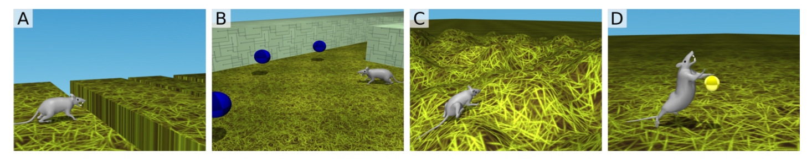
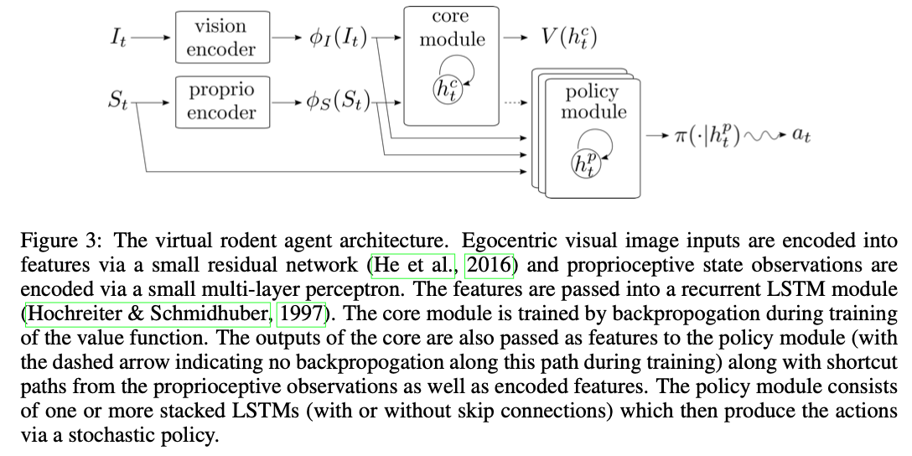
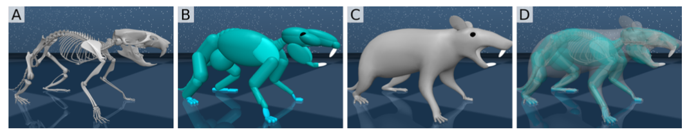

## Summary Of Deep Neuroethology Of A Virtual Rodent

Merel, Josh et al. “[Deep neuroethology of a virtual rodent.](https://openreview.net/pdf?id=SyxrxR4KPS)” arXiv: Neurons and Cognition (2020): n. pag.

My main interest in reading this paper stems from their implementation of a virtual rodent. Consequently, I will be focusing on just this aspect in the summary. At HDILab, we are working on designing a baby agent, albeit a simplistic one, with sensory and motor abilities closely representative of a human baby’s. The paper’s implementation of the virtual rodent is based on measurements, including joint and tendon measurements, of lab rats. Once we study the architecture used in this paper to design the rodent, we can maybe able to design our baby agent using human baby measurements using a similar architecture.

**Crux of the paper**

The paper sets out to use neuroscience methods to understand a trained deep network controlling an embodied agent – the rodent. They train a single DNN capable of actuating a variety of complex locomotor activities in the virtual rodent to solve multiple tasks using a single policy.

1. Running at a target velocity over gaps along a corridor. Reward is given when target velocity is achieved.

2. Foraging through a maze to gather collectables (blue orbs). Reward is given for acquiring each blue orb

3. Escaping a bowl shaped hilly terrain. Reward is proportional to the distance covered from the center of the terrain.

4. Activating orbs in an open field by tapping them twice within a tap interval of 800 ms. Sparse rewards are provided on the first and second tap.

Ex: …. approaches in which artificial models that solve tasks similar to those solved by animals serve as normative models of biological intelligence. Researchers have attempted to leverage these models to gain insights into the functional transformations implemented by neurobiological circuits ……

The authors believe that analyzing the DNN controlling the rodent, while it while it achieves the flexibility to perform multiple tasks, could result in important findings that could help identify algorithms that are capable of flexible control in artificial systems.

Ex: The virtual rodent affords a new opportunity to directly compare principles of artificial control to biological data from real-world rodents

Previous work in this area test “cognitive flexibility” (Yang et al. 2019) in isolation without motor commands, or studies motor dynamics of real mammals but without task flexibility However, this work require the agent to implement flexible cognition using a complex body in a physical environment along with egocentric input.

**Architecture of the virtual rodent**

The body of the virtual rodent is designed in MuJoCo (Todorov et al., 2012) based on measurements of lab rats. The rodent body comprises multiple segments in including joint. Segments of body are controlled by tendons that can activate multiple joints.

As inputs, the virtual rodent has access to proprioceptive information as well as “raw” egocentric RGB-camera (64×64 pixels) input from a head-mounted camera. The proprioceptive inputs include internal joint angles and angular velocities, positions and velocities of the tendons that provide actuation, egocentric vectors from the root (pelvis) of the body to the positions of the head and paws, a vestibular-like upright orientation vector, touch or contact sensors in the paws, as well as egocentric acceleration, velocity, and 3D angular velocity of the root.

<!-- rodent-paper-summary -->
